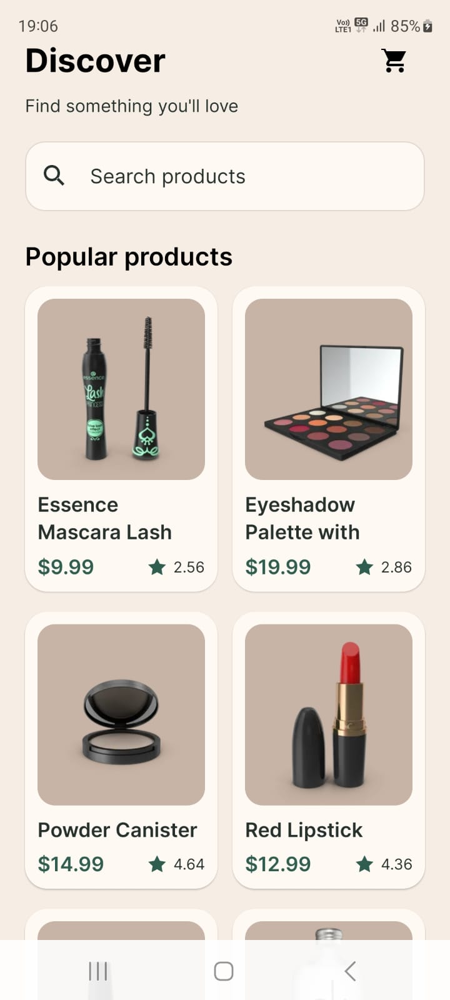
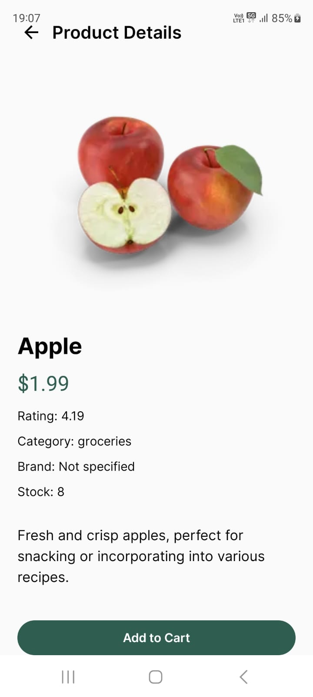
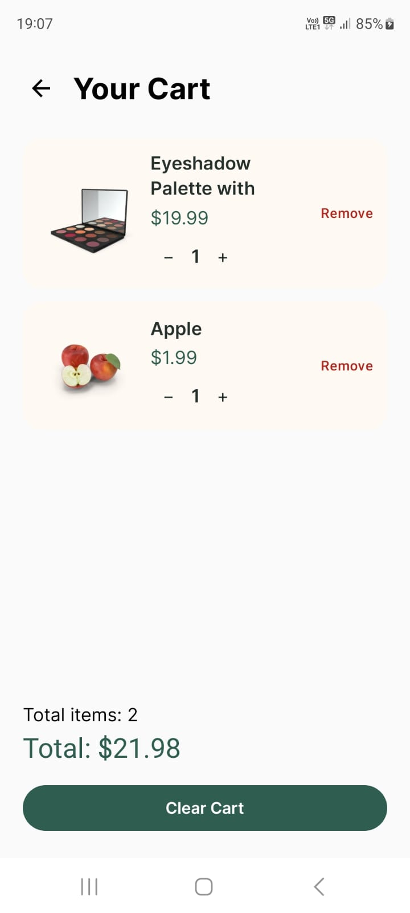

# Product Catalog

An Android product catalog application built with **Kotlin and Jetpack Compose**, featuring product browsing, search, product details, and a fully persistent offline cart.

## Screenshots
<p align="center">
  
  
  
</p>

## Features

### Product Catalog

* Displays product image, name, price, and rating
* Loading state while products are being fetched
* Empty state when no products are available
* API/network error state with retry support

### Search

* Search products using the DummyJSON search API
* Debounced search requests
* Empty state for queries with no matching products

### Product Details

* Product image
* Product name
* Description
* Price
* Rating
* Category
* Brand
* Stock
* Add to Cart functionality

### Cart

* Add products to cart
* Increase/decrease quantity
* Remove individual products
* View all cart items
* Total item count
* Total cart price
* Clear cart
* Cart persists after closing and reopening the app

### Offline Support

* Cart remains accessible without an internet connection
* Cart quantities can be increased/decreased offline
* Cart items can be removed offline
* Cart totals remain available offline
* Cart images are stored locally so they remain available offline

The product catalog itself remains API-backed and therefore requires an internet connection to load or search products.

## Tech Stack

| Technology               | Usage                             |
| ------------------------ | --------------------------------- |
| Kotlin                   | Application language              |
| Jetpack Compose          | UI                                |
| MVVM                     | Architecture                      |
| Retrofit                 | REST API communication            |
| OkHttp                   | HTTP client                       |
| DummyJSON                | Product API                       |
| Room                     | Cart persistence                  |
| Kotlin Coroutines & Flow | Asynchronous operations and state |
| Coil                     | Product image loading             |
| Navigation Compose       | Screen navigation                 |
| Gradle                   | Build system                      |

## Architecture

The application follows an **MVVM architecture** with repositories separating the UI layer from remote and local data sources.

```text
                    UI
                     │
          ┌──────────┴──────────┐
          │                     │
   Product Screens          Cart Screen
          │                     │
          ▼                     ▼
   ProductViewModel       CartViewModel
          │                     │
          ▼                     ▼
   ProductRepository      CartRepository
          │                     │
          │              ┌──────┴──────┐
          │              │             │
          ▼              ▼             ▼
      Retrofit          Room       Local Image
          │                         Storage
          ▼
      DummyJSON
```

## Project Structure

```text
com.ayushi.productcatalog
│
├── data
│   ├── local
│   │   ├── CartEntity.kt
│   │   ├── CartDao.kt
│   │   └── CartDatabase.kt
│   │
│   ├── model
│   │   ├── Product.kt
│   │   └── ProductResponse.kt
│   │
│   ├── remote
│   │   ├── ProductApi.kt
│   │   └── RetrofitInstance.kt
│   │
│   └── repository
│       ├── ProductRepository.kt
│       └── CartRepository.kt
│
├── ui
│   ├── cart
│   │   ├── CartViewModel.kt
│   │   ├── CartScreen.kt
│   │   └── CartItemRow.kt
│   │
│   ├── navigation
│   │   └── AppNavigation.kt
│   │
│   ├── product
│   │   ├── ProductViewModel.kt
│   │   ├── ProductScreen.kt
│   │   ├── ProductCard.kt
│   │   └── ProductDetailScreen.kt
│   │
│   └── theme
│
└── util
    └── ImageStorage.kt
```

## API Integration

The application uses the [DummyJSON Products API](https://dummyjson.com/).

Endpoints used:

```text
GET /products
GET /products/search?q={query}
```

Retrofit is used for API communication and Kotlin coroutines are used for asynchronous requests.

Search input is debounced by **400ms** before triggering an API request to avoid unnecessary calls while typing.

## Local Storage

**Room** is used to persist cart information locally.

Each cart item stores:

* Product ID
* Product title
* Price
* Thumbnail/local image path
* Quantity

When a product is first added to the cart, its image is downloaded to the application's internal storage.

This allows both the cart data and its images to remain available after the application is closed and reopened without an internet connection.

## Error Handling

The application handles:

* Loading states
* No internet connection
* API request failures
* Network timeouts
* Empty search results
* Empty product responses
* Retry after API failure

When a product request fails, the application displays an error message with a **Retry** action.

## Design Decisions

### Jetpack Compose

Jetpack Compose was used to build the UI and represent different application states through composable functions.

### MVVM

ViewModels manage UI state and user interactions while repositories provide separation between the UI and data sources.

### Room for Cart Persistence

Room was selected because the cart needs to survive application restarts and remain functional without network access.

### Local Image Storage

Storing only the remote image URL would not guarantee that cart images would be available offline. Therefore, images are copied into application-local storage when products are added to the cart.

### Debounced Search

Search requests are debounced by 400ms to reduce unnecessary network requests while the user is typing.

## Setup & Build

### Requirements

* Android Studio
* Android SDK
* JDK compatible with the project's Gradle configuration
* Android device or emulator

### Run the Application

1. Clone the repository.
2. Open the project in Android Studio.
3. Allow Gradle to sync and download dependencies.
4. Connect an Android device or start an emulator.
5. Run the `app` configuration.

### Build from Command Line

**Windows:**

```bash
gradlew.bat assembleDebug
```

**macOS/Linux:**

```bash
./gradlew assembleDebug
```

## Testing

The following flows were manually tested:

* Product listing
* Product search
* Empty search results
* Product details
* Add to cart
* Increase/decrease quantity
* Remove cart items
* Cart totals
* Cart persistence after application restart
* Cart functionality without internet access
* Offline availability of persisted cart images
* API error and retry behavior

## Limitations

* The product catalog depends on the DummyJSON API and is not cached for full offline browsing.
* Product search requires an internet connection.
* Offline functionality is focused on the cart.
* Product images are stored locally when products are added to the cart.
